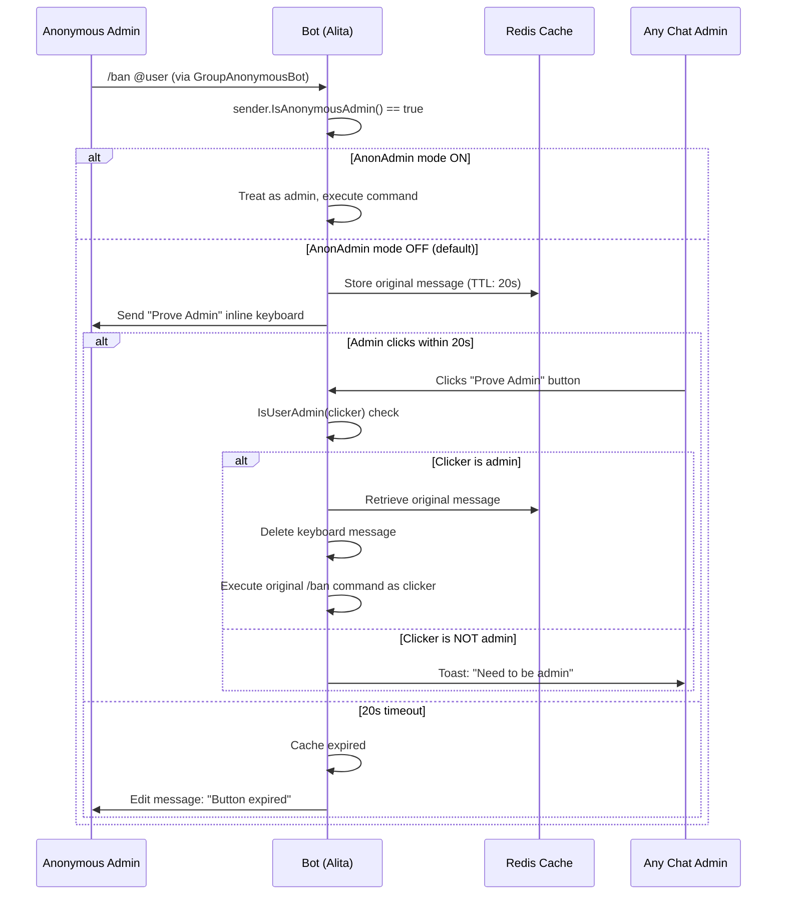

<objective>
Install the Mermaid rendering plugin and create the anonymous admin verification flow documentation page with a sequence diagram.

Purpose: Anonymous admin mode is a non-obvious interaction pattern where Telegram's GroupAnonymousBot identity prevents normal admin verification. The bot has two code paths (AnonAdmin ON = auto-trust, AnonAdmin OFF = keyboard verification with 20s TTL). Operators need to understand this flow to configure it correctly and debug "button expired" complaints.

Output: `starlight-client-mermaid` installed and configured; new `architecture/anonymous-admin.md` page with rendered Mermaid sequence diagram.
</objective>

<execution_context>
@/Users/divkix/.claude/get-shit-done/workflows/execute-plan.md
@/Users/divkix/.claude/get-shit-done/templates/summary.md
</execution_context>

<context>
@.planning/PROJECT.md
@.planning/ROADMAP.md
@.planning/STATE.md
@.planning/phases/04-operator-documentation/04-RESEARCH.md

Source files for anon admin flow (READ for verification, do NOT modify):
@alita/utils/chat_status/chat_status.go (checkAnonAdmin, setAnonAdminCache, getAnonAdminCache)
@alita/utils/chat_status/helpers.go (sendAnonAdminKeyboard)
@alita/modules/bot_updates.go (verifyAnonymousAdmin callback handler)

Docs config files to modify:
@docs/package.json
@docs/astro.config.mjs
</context>

<tasks>

<task type="auto">
  <name>Task 1: Install starlight-client-mermaid and configure astro.config.mjs</name>
  <files>docs/package.json, docs/astro.config.mjs</files>
  <action>
**Step 1: Install the Mermaid plugin.**

```bash
cd /Users/divkix/GitHub/Alita_Robot/docs && bun add starlight-client-mermaid
```

This adds `starlight-client-mermaid` to `dependencies` in `docs/package.json`.

**Step 2: Add plugin to astro.config.mjs.**

Add the import at the top of `docs/astro.config.mjs` after the existing imports:
```js
import starlightClientMermaid from 'starlight-client-mermaid';
```

Add `starlightClientMermaid()` to the `plugins` array in the starlight config. The plugins array currently has:
```js
plugins: [starlightThemeBlack({}), starlightLlmsTxt(), starlightLinksValidator()]
```

Change it to:
```js
plugins: [starlightThemeBlack({}), starlightClientMermaid(), starlightLlmsTxt(), starlightLinksValidator()]
```

Place `starlightClientMermaid()` BEFORE `starlightLlmsTxt()` and `starlightLinksValidator()` — the order matters for Starlight plugins. The Mermaid plugin needs to process content before the links validator runs.

**Do NOT modify any other config (sidebar, social, customCss, etc.).**
  </action>
  <verify>
    <automated>cd /Users/divkix/GitHub/Alita_Robot/docs && bun run build 2>&1 | tail -20</automated>
  </verify>
  <done>starlight-client-mermaid is in package.json dependencies and configured in astro.config.mjs plugins array. Docs build passes.</done>
</task>

<task type="auto">
  <name>Task 2: Create anonymous-admin.md with Mermaid sequence diagram</name>
  <files>docs/src/content/docs/architecture/anonymous-admin.md</files>
  <action>
Create `docs/src/content/docs/architecture/anonymous-admin.md` with the following structure:

**Frontmatter:**
```yaml
---
title: Anonymous Admin Verification
description: How Alita Robot handles admin commands sent via Telegram's anonymous admin mode.
---
```

**Content sections (in order):**

1. **Introduction paragraph** — Explain the problem: When a group admin enables "Send as Group" (anonymous admin mode), Telegram sends their messages as `GroupAnonymousBot` (ID 1087968824). The bot cannot identify which admin sent the command. Alita Robot provides two modes to handle this: automatic trust (AnonAdmin ON) or keyboard verification (AnonAdmin OFF, the default).

2. **AnonAdmin Modes section** — Two subsections:

   **AnonAdmin Mode ON (`/anonadmin on`):**
   - When enabled via admin settings, the bot treats all anonymous admin messages as legitimate admin commands
   - The command executes immediately without verification
   - Trade-off: faster execution but any admin can impersonate another

   **AnonAdmin Mode OFF (default):**
   - The bot stores the original message in Redis with a 20-second TTL
   - An inline keyboard with a "Prove Admin" button is sent to the chat
   - Any chat admin can click the button to verify and execute the command
   - If no admin clicks within 20 seconds, the button expires

3. **Verification Flow section** — The Mermaid sequence diagram. Use this exact diagram (verified against source code):



4. **Technical Details section** — Document the implementation specifics:
   - **Cache key format:** `alita:anonAdmin:{chatId}:{msgId}` with 20-second TTL
   - **Callback data encoding:** Versioned codec format `anon_admin|v1|c={chatId}&m={msgId}` with legacy fallback `alita:anonAdmin:{chatId}:{msgId}` for backward compatibility
   - **Command re-dispatch:** After verification, the bot sets `ctx.EffectiveMessage = original_msg`, clears `SenderChat` (prevents re-triggering anon detection), clears `CallbackQuery`, extracts the command from message text, and dispatches to the appropriate handler via a switch statement
   - **Non-admin click handling:** Shows a toast notification ("Need to be admin") without error; does not consume the keyboard

5. **Supported Commands section** — List all commands that work through the anonymous admin switch, grouped by module:

   | Module | Commands |
   |--------|----------|
   | Admin | `/promote`, `/demote`, `/title` |
   | Bans | `/ban`, `/dban`, `/sban`, `/tban`, `/unban`, `/restrict`, `/unrestrict` |
   | Mutes | `/mute`, `/smute`, `/dmute`, `/tmute`, `/unmute` |
   | Pins | `/pin`, `/unpin`, `/permapin`, `/unpinall` |
   | Purges | `/purge`, `/del` |
   | Warns | `/warn`, `/swarn`, `/dwarn` |

6. **Troubleshooting section** using `:::tip` admonition — Common issues:
   - "Button expired" — Admin did not click within 20 seconds. The cache entry has been evicted. The admin must re-send the command.
   - "Need to be admin" — A non-admin user clicked the "Prove Admin" button. Only actual chat admins can verify.
   - Commands not executing in anonymous mode — The command may not be in the supported commands list above. Only commands with explicit anon admin switch cases are supported.

7. **Related Pages section** — Links to:
   - [Handler Group Precedence](/architecture/handler-groups) — How message watchers interact with command processing
   - [Request Flow](/architecture/request-flow) — Full update processing pipeline

Use plain Markdown with `:::tip` and `:::caution` admonitions. Do NOT use MDX imports — plain `.md` extension is correct. The Mermaid code fence will be rendered by `starlight-client-mermaid`.
  </action>
  <verify>
    <automated>cd /Users/divkix/GitHub/Alita_Robot/docs && bun run build 2>&1 | tail -20</automated>
  </verify>
  <done>anonymous-admin.md exists in architecture directory with rendered Mermaid sequence diagram, both AnonAdmin modes documented, supported commands table, and troubleshooting tips. Docs build passes.</done>
</task>

</tasks>

<verification>
1. `cd docs && bun run build` passes with zero errors
2. `anonymous-admin.md` contains a `sequenceDiagram` Mermaid block
3. `package.json` contains `starlight-client-mermaid` in dependencies
4. `astro.config.mjs` imports and registers `starlightClientMermaid` in plugins array
5. The Mermaid diagram is NOT rendered as a raw code block in the build output (verify by checking that the build does not contain a literal ` ```mermaid ` in the HTML output)
</verification>

<success_criteria>
- starlight-client-mermaid is installed and configured
- anonymous-admin.md exists at `docs/src/content/docs/architecture/anonymous-admin.md`
- The Mermaid sequence diagram shows the complete anonymous admin verification flow
- Both AnonAdmin ON and OFF modes are documented
- All 23 supported commands are listed by module
- `cd docs && bun run build` passes clean
</success_criteria>

<output>
After completion, create `.planning/phases/04-operator-documentation/04-02-SUMMARY.md`
</output>
