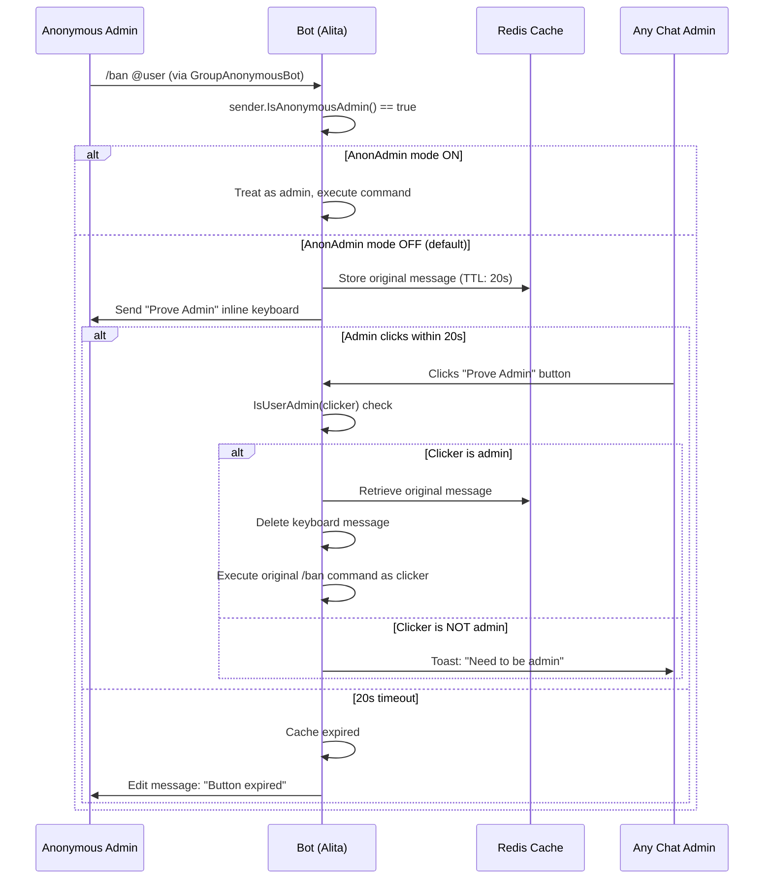

# Phase 4: Operator Documentation - Research

**Researched:** 2026-02-28
**Domain:** Markdown/MDX documentation authoring for Starlight, Go codebase archeology
**Confidence:** HIGH

## Summary

Phase 4 requires three new documentation pages in the Astro/Starlight docs site. The content is entirely sourced from reading the codebase — no external APIs, no DB migrations, no code changes. The work is purely MDX/Markdown authoring inside `docs/src/content/docs/`.

The handler group precedence table is definitive: group numbers are hardcoded constants in module struct initializers, confirmed by direct code inspection. The anonymous admin flow is fully documented in `alita/utils/chat_status/` and `alita/modules/bot_updates.go`. The dev/owner commands are already partially documented in `docs/src/content/docs/commands/devs/index.md` but need explicit "owner-only, not surfaced to regular users" language and a dedicated operator-focused section.

The critical decision is Mermaid diagram support. Starlight 0.37.6 does NOT ship Mermaid natively. The requirement specifies a Mermaid sequence diagram. Two paths exist: install `starlight-client-mermaid` plugin (~1 bun install + 2-line config change), or use ASCII/text-based sequence notation and note it's non-interactive. The install path is lower risk since it's a docs-only dependency with no runtime impact.

**Primary recommendation:** Install `starlight-client-mermaid`, add the Mermaid sequence diagram for anon admin flow. This is a docs-site dependency only — zero risk to bot runtime.

<phase_requirements>
## Phase Requirements

| ID | Description | Research Support |
|----|-------------|-----------------|
| OPER-01 | Document message watcher handler group precedence (which fires first: antispam at -2, captcha at -10, antiflood, blacklists, filters, locks) | Handler group numbers confirmed by direct code inspection of all 8 message watcher modules |
| OPER-02 | Document anonymous admin verification flow with sequence diagram | Full flow traced through `chat_status.go`, `helpers.go`, and `bot_updates.go` |
| OPER-03 | Add developer/owner commands section with explicit "owner-only" access note | `devs.go` fully read; existing `commands/devs/index.md` partially covers this but lacks operator framing |
</phase_requirements>

## Standard Stack

### Core

| Library | Version | Purpose | Why Standard |
|---------|---------|---------|--------------|
| Astro Starlight | 0.37.6 | Docs site framework | Already installed — project standard |
| MDX | Built-in | Extended Markdown with JSX | Used throughout existing docs |
| Starlight components | Built-in | `Badge`, `Steps`, `Card`, `CardGrid` | Used in existing docs files |

### Supporting

| Library | Version | Purpose | When to Use |
|---------|---------|---------|-------------|
| starlight-client-mermaid | latest | Client-side Mermaid diagram rendering in Starlight | Required if using Mermaid sequence diagrams for OPER-02 |
| starlight-links-validator | 0.19.2 | Broken link detection | Already installed as devDependency — run in CI |

### Alternatives Considered

| Instead of | Could Use | Tradeoff |
|------------|-----------|----------|
| starlight-client-mermaid | ASCII diagram (like existing request-flow.mdx) | ASCII works today with zero install; Mermaid is richer and requirement explicitly says "Mermaid sequence diagram" — ASCII won't satisfy OPER-02 |
| starlight-client-mermaid | remark-mermaidjs + Playwright (server-side) | More complex setup, requires Playwright installed in docs build; client-side plugin is simpler |

**Installation (if Mermaid path chosen):**
```bash
cd docs
bun add starlight-client-mermaid
```

Then add to `docs/astro.config.mjs` plugins array:
```js
import starlightClientMermaid from 'starlight-client-mermaid';
// in starlight({ plugins: [..., starlightClientMermaid()] })
```

## Architecture Patterns

### Existing Docs Structure

```
docs/src/content/docs/
├── architecture/           # Technical architecture docs (module-pattern, caching, request-flow, project-structure)
├── commands/               # Per-module command references (admin, bans, captcha, devs, filters, locks, ...)
├── api-reference/          # callbacks, commands, database-schema, environment, lock-types, permissions
├── self-hosting/           # Docker, binary, webhooks, monitoring, troubleshooting
├── getting-started/        # Introduction, quick-start
└── contributing/           # Dev setup guide
```

Sidebar in `astro.config.mjs` uses `autogenerate: { directory: 'architecture' }` — new files in any existing directory appear automatically. No sidebar config changes needed unless a new top-level directory is created.

### Where to Place the Three New Pages

| Requirement | Recommended Location | Rationale |
|------------|---------------------|-----------|
| OPER-01 (handler group precedence) | `docs/src/content/docs/architecture/handler-groups.md` | Technical mechanics, fits architecture section; existing architecture docs cover request-flow and module-pattern |
| OPER-02 (anon admin flow) | `docs/src/content/docs/architecture/anonymous-admin.md` | Architectural behavior, not just a command reference |
| OPER-03 (dev/owner commands) | Extend `docs/src/content/docs/commands/devs/index.md` | File already exists with partial content; adding explicit "owner-only" operator framing and access levels |

Alternative: Create a new `operator-guide/` top-level section. However, this requires sidebar config changes (`astro.config.mjs`) and a new directory. Given that the architecture section already has related content (request-flow covers handler groups briefly), extending architecture is lower friction.

### Pattern: Existing Architecture Docs Style

The `request-flow.mdx` file already contains a handler group tip:
```mdx
:::tip[Handler group conventions]
- **Negative groups (-1, -10)**: Early interception handlers (antispam, antiflood)
- **Group 0**: Standard command handlers (default)
- **Positive groups (4-10)**: Message watchers and monitors that should not block downstream processing
:::
```

This is incomplete/inaccurate (antispam is -2, not "negative groups"; captcha is -10; antiflood is 4, not negative). OPER-01 page must correct this with the definitive table.

### Anti-Patterns to Avoid

- **Don't create a new top-level directory** without updating `astro.config.mjs` sidebar — new directories are not auto-discovered
- **Don't copy command docs format** (alias tables, disableable column) for architecture pages — different audience, different format
- **Don't use ASCII art diagrams for the anon admin flow** if Mermaid is installed — the requirement explicitly states "Mermaid sequence diagram"
- **Don't add starlight-links-validator errors** — verify all internal links (`[Architecture](/architecture/handler-groups)`) match actual page slugs

## Don't Hand-Roll

| Problem | Don't Build | Use Instead | Why |
|---------|-------------|-------------|-----|
| Mermaid diagrams | Manual ASCII art | starlight-client-mermaid | Requirement explicitly specifies Mermaid; ASCII won't satisfy OPER-02 success criteria |
| Starlight admonitions | Raw HTML | `:::note`, `:::caution`, `:::tip` | Already used throughout codebase; consistent with existing docs |
| Sidebar config for new files in existing dirs | Manual sidebar entries | autogenerate (already configured) | Architecture and commands dirs are already auto-generated; files just need correct frontmatter |

**Key insight:** This phase is docs-only. No Go code changes. The "hand-roll" trap here is spending time on layout/design instead of accurate content sourced from the code.

## Common Pitfalls

### Pitfall 1: Handler Group Number Inaccuracy
**What goes wrong:** Using approximate group numbers ("negative = early") instead of the actual hardcoded values
**Why it happens:** The `request-flow.mdx` already has an inaccurate tip that says "antispam" is in "negative groups" without specifying -2
**How to avoid:** Use the exact numbers from code — the table below is sourced from direct inspection
**Warning signs:** Any group number not listed in the definitive table below

### Pitfall 2: Mermaid Not Rendering
**What goes wrong:** Writing `\`\`\`mermaid` blocks without installing the plugin — they render as code fences
**Why it happens:** Starlight 0.37.6 does not bundle Mermaid
**How to avoid:** Install `starlight-client-mermaid` and add to `astro.config.mjs` plugins BEFORE writing Mermaid blocks; verify build succeeds
**Warning signs:** `bun run build` shows `\`\`\`mermaid` in output HTML as a literal code block

### Pitfall 3: Internal Link Breakage
**What goes wrong:** `starlight-links-validator` (already installed) will fail build if page references wrong slug
**Why it happens:** Starlight slugs are derived from directory path and file name; e.g. `docs/src/content/docs/architecture/handler-groups.md` → slug `/architecture/handler-groups`
**How to avoid:** Use absolute Starlight paths: `/architecture/handler-groups` not relative `./handler-groups`
**Warning signs:** Build fails with "link validation error"

### Pitfall 4: Inaccurate Dev Command Access Levels
**What goes wrong:** Documenting a command as "owner only" when it's actually "owner or dev"
**Why it happens:** The three tiers (owner-only, owner+dev, all team members) have different implementation patterns
**How to avoid:** Verify each function's guard condition in `devs.go` before writing access level — confirmed table below

### Pitfall 5: Mermaid Sequence Diagram Syntax Error
**What goes wrong:** Invalid Mermaid syntax that fails to render client-side
**Why it happens:** Mermaid sequence diagram syntax has specific participant/actor rules
**How to avoid:** Test diagram in Mermaid Live Editor (mermaid.live) before embedding

## Code Examples

### Definitive Handler Group Precedence Table

Sourced by direct inspection of all module struct initializers and `AddHandlerToGroup` calls:

| Group | Module | Handler Function | Filter | Return on Match | Notes |
|-------|--------|-----------------|--------|-----------------|-------|
| -10 | Captcha | `handlePendingCaptchaMessage` | nil (all) | `EndGroups` | Intercepts messages from users with pending captcha; stores and deletes message |
| -2 | Antispam | (inline closure) | `message.All` | `EndGroups` | Rate-limits spamming users; passes through if not spamming |
| -1 | Users | `logUsers` | `message.All` | `ContinueGroups` | Logs user activity; never blocks propagation |
| 0 | All modules | Commands, callbacks | Various | varies | Default group; standard command handlers |
| 4 | Antiflood | `checkFlood` | `message.All` | `EndGroups` on flood, `ContinueGroups` otherwise | Flood control; skips anon admins and media groups |
| 5 | Locks | `permHandler` | `message.All` | `EndGroups` on violation | Checks permission-based locks (can_send_messages, etc.) |
| 6 | Locks | `restHandler` | `message.All` | `EndGroups` on violation | Checks restriction-based locks (stickers, animations, etc.) |
| 7 | Blacklists | `blacklistWatcher` | non-command, non-media-group | `ContinueGroups` (always) | Checks words against blacklist; action taken but processing continues |
| 8 | Reports | (handler) | `message.All` | varies | Report tracking |
| 9 | Filters | `filtersWatcher` | non-command, non-media-group | `ContinueGroups` (always) | Matches filter patterns; sends configured response but doesn't block |
| 10 | Pins | (handler) | `message.All` | `EndGroups` | Anti-channel-pin watcher |

**Critical behavior — antispam EndGroups stops ALL further group processing:** When antispam returns `EndGroups`, captcha-pending message storage, antiflood, locks, blacklists, and filters all stop. A rate-limited message never reaches any other watcher.

**Critical behavior — captcha is first (-10 is lowest):** Any message from a user with pending captcha is intercepted, stored (for delivery after verification), and deleted. The message NEVER reaches antiflood, blacklists, or filters.

### Anon Admin Flow — Code-Verified Steps

From `alita/utils/chat_status/chat_status.go` and `alita/modules/bot_updates.go`:

**Flow (step by step):**
1. Admin uses an admin command (e.g., `/ban`) via the group anonymous admin account
2. `ctx.EffectiveSender.IsAnonymousAdmin()` returns true (sender is `GroupAnonymousBot` ID 1087968824)
3. `checkAnonAdmin()` is called from the relevant `Can*` or `Require*` permission function
4. **If `AnonAdmin` mode is ON** (`db.GetAdminSettings(chat.Id).AnonAdmin == true`): function returns `isAdmin=true, shouldReturn=true` — the original command proceeds immediately, no keyboard needed
5. **If `AnonAdmin` mode is OFF** (default): `setAnonAdminCache(chatId, msg)` stores the original message in Redis with 20-second TTL at key `alita:anonAdmin:{chatId}:{msgId}`; then `sendAnonAdminKeyboard()` sends an inline keyboard to the chat
6. The keyboard button callback data is encoded as `anon_admin|v1|c={chatId}&m={msgId}` (versioned codec) with legacy fallback `alita:anonAdmin:{chatId}:{msgId}`
7. An admin clicks the "Prove Admin" button in the chat
8. `verifyAnonymousAdmin()` callback handler fires
9. `IsUserAdmin(b, chatId, query.From.Id)` is called — if the clicker is NOT an admin, shows "need admin" toast and stops
10. If the clicker IS an admin: retrieves original message from cache via `getAnonAdminCache(chatId, msgId)`
11. If cache expired (>20s): edits keyboard message to "expired" text, stops
12. If cache hit: deletes the keyboard message; sets `ctx.EffectiveMessage = msg` (the original message); sets `ctx.EffectiveMessage.SenderChat = nil` (prevents re-triggering anon detection); sets `ctx.CallbackQuery = nil`; extracts command from message text; dispatches to appropriate handler via switch statement

**Commands supported via anon admin switch:**
- admin: `/promote`, `/demote`, `/title`
- bans: `/ban`, `/dban`, `/sban`, `/tban`, `/unban`, `/restrict`, `/unrestrict`
- mutes: `/mute`, `/smute`, `/dmute`, `/tmute`, `/unmute`
- pins: `/pin`, `/unpin`, `/permapin`, `/unpinall`
- purges: `/purge`, `/del`
- warns: `/warn`, `/swarn`, `/dwarn`

### Dev Command Access Levels — Code-Verified

From `alita/modules/devs.go`:

| Command | Guard Condition | Access Level |
|---------|----------------|--------------|
| `/stats` | `user.Id != config.AppConfig.OwnerId && !memStatus.Dev` → continue if not owner/dev | Owner or Dev |
| `/chatinfo` | Same as stats | Owner or Dev |
| `/chatlist` | Same as stats | Owner or Dev |
| `/leavechat` | Same as stats | Owner or Dev |
| `/addsudo` | `user.Id != config.AppConfig.OwnerId` → continue if not owner | Owner Only |
| `/adddev` | Same as addsudo | Owner Only |
| `/remsudo` | Same as addsudo | Owner Only |
| `/remdev` | Same as addsudo | Owner Only |
| `/teamusers` | User must be in `teamint64Slice` (includes owner + all team members) | Any Team Member (owner, sudo, dev) |

**Key distinction:** Commands that "continue" when permission check fails are silently ignored (not errors) — they just don't execute. This means unauthorized users get no response, not an error message.

### Mermaid Sequence Diagram for Anon Admin Flow



### Existing Frontmatter Pattern

Architecture docs use `.md` extension (not `.mdx`) unless they need JSX imports. The `request-flow.mdx` uses MDX for `Badge` and `Steps`. A new `handler-groups.md` page can be plain Markdown if it only uses fenced admonitions (`:::note`) and tables.

```yaml
---
title: Handler Group Precedence
description: Which message watchers fire first and how propagation works in Alita Robot.
---
```

## State of the Art

| Old Approach | Current Approach | When Changed | Impact |
|--------------|------------------|--------------|--------|
| Dot-notation callback data (`alita.anonAdmin.123.456`) | Versioned codec (`anon_admin\|v1\|c=123&m=456`) with legacy fallback | Recent refactor | Sequence diagram must document new codec format; legacy fallback exists for backward compat |
| Global `request-flow.mdx` tip (inaccurate group numbers) | Authoritative `handler-groups.md` page (this phase) | N/A — being fixed now | `request-flow.mdx` tip should be updated to link to new page |

**Deprecated/outdated:**
- The tip in `request-flow.mdx` lines 269-273 says "Negative groups (-1, -10): Early interception handlers (antispam, antiflood)" — this is wrong. Antispam is -2, not -1 or -10. Antiflood is 4 (positive). This tip should either be removed or updated to link to the authoritative handler-groups page after this phase.

## Open Questions

1. **Mermaid plugin installation decision**
   - What we know: Requirement says "Mermaid sequence diagram"; Starlight 0.37.6 has no native Mermaid; `starlight-client-mermaid` is the standard plugin
   - What's unclear: Whether the planner should include bun install + astro config change as a task, or treat this as a known dependency
   - Recommendation: Include as explicit Wave 0/setup task in 04-02 plan; it's a prerequisite for the diagram

2. **Update `request-flow.mdx` inaccurate handler group tip**
   - What we know: The tip on lines 269-273 of `request-flow.mdx` has wrong group numbers
   - What's unclear: Whether fixing this tip is in-scope for Phase 4 or Phase 5 (verification)
   - Recommendation: Include as a sub-task in 04-01 plan since it's the same file area; it's a 2-line fix

3. **New `architecture/` pages vs. new `operator-guide/` section**
   - What we know: Sidebar is auto-generated for `architecture/` — no config change needed
   - What's unclear: Whether OPER-01 and OPER-02 content belongs in `architecture/` (technical) or needs a separate operator section
   - Recommendation: Use `architecture/` to avoid sidebar config changes; operator audience can find it there

## Validation Architecture

### Test Framework

| Property | Value |
|----------|-------|
| Framework | go test (Go standard) + `make build` for docs build validation |
| Docs framework | Astro + starlight-links-validator (already installed) |
| Quick run command | `cd docs && bun run build` |
| Full suite command | `make test && cd docs && bun run build` |

### Phase Requirements → Test Map

| Req ID | Behavior | Test Type | Automated Command | File Exists? |
|--------|----------|-----------|-------------------|-------------|
| OPER-01 | Handler group precedence page exists in docs | smoke | `cd docs && bun run build` (links-validator catches broken refs) | ❌ Wave 0 — create `architecture/handler-groups.md` |
| OPER-02 | Anonymous admin sequence diagram renders in docs | smoke | `cd docs && bun run build` + visual check | ❌ Wave 0 — create `architecture/anonymous-admin.md` + install Mermaid plugin |
| OPER-03 | Dev commands page has explicit access level notes | manual | Read `commands/devs/index.md` — verify "owner-only" language exists | ❌ Wave 0 — extend existing `commands/devs/index.md` |

### Sampling Rate

- **Per task commit:** `cd docs && bun run build`
- **Per wave merge:** `make test && cd docs && bun run build`
- **Phase gate:** Full suite green before `/gsd:verify-work`

### Wave 0 Gaps

- [ ] `docs/src/content/docs/architecture/handler-groups.md` — covers OPER-01
- [ ] `docs/src/content/docs/architecture/anonymous-admin.md` — covers OPER-02
- [ ] `starlight-client-mermaid` installed and configured in `docs/astro.config.mjs` — prerequisite for OPER-02 diagram
- [ ] Extended `docs/src/content/docs/commands/devs/index.md` with operator-focused access level documentation — covers OPER-03

## Sources

### Primary (HIGH confidence)

- Direct code inspection of `alita/modules/antispam.go` (group -2), `captcha.go` (group -10), `users.go` (group -1), `antiflood.go` (group 4), `locks.go` (groups 5,6), `blacklists.go` (group 7), `reports.go` (group 8), `filters.go` (group 9), `pins.go` (group 10)
- Direct code inspection of `alita/utils/chat_status/chat_status.go` and `helpers.go` — anon admin flow
- Direct code inspection of `alita/modules/bot_updates.go` — `verifyAnonymousAdmin()` callback handler
- Direct code inspection of `alita/modules/devs.go` — all 9 dev commands with guard conditions
- `docs/astro.config.mjs` — sidebar configuration (autogenerate pattern confirmed)
- `docs/package.json` — Starlight 0.37.6, no Mermaid dependency present

### Secondary (MEDIUM confidence)

- WebSearch: "Astro Starlight Mermaid diagrams support 2026 plugin" — confirmed `starlight-client-mermaid` is standard plugin; Starlight GitHub Discussion #1259 confirms no native Mermaid support
- Existing docs at `docs/src/content/docs/architecture/request-flow.mdx` — handler group conventions tip (partially inaccurate — confirmed by code inspection)

### Tertiary (LOW confidence)

- None

## Metadata

**Confidence breakdown:**
- Handler group table: HIGH — all numbers verified by direct code inspection of struct initializers
- Anon admin flow: HIGH — traced through 3 source files end-to-end
- Dev command access levels: HIGH — verified each guard condition in devs.go
- Mermaid plugin availability: MEDIUM — WebSearch confirmed; not yet installed/tested in this project
- Docs placement recommendation: MEDIUM — logical fit, no user decision recorded

**Research date:** 2026-02-28
**Valid until:** 2026-03-28 (stable codebase; only invalidated if handler groups are refactored)
