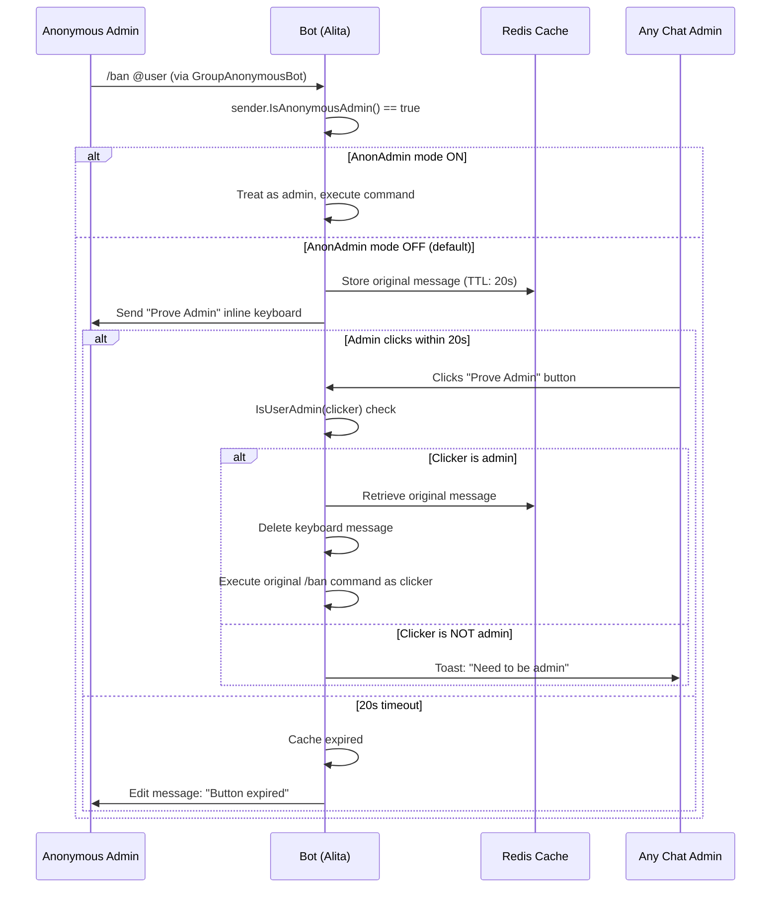

# Anonymous Admin Verification

When a group admin enables "Send as Group" (anonymous admin mode), Telegram sends their messages as `GroupAnonymousBot` (ID `1087968824`). The bot cannot identify which admin sent the command. Alita Robot provides two modes to handle this: automatic trust (AnonAdmin ON) or keyboard verification (AnonAdmin OFF, the default).

## AnonAdmin Modes

### AnonAdmin Mode ON (`/anonadmin on`)

When enabled via admin settings, the bot treats all anonymous admin messages as legitimate admin commands. The command executes immediately without verification.

:::caution[Security trade-off]
AnonAdmin ON is faster but any admin can execute commands without individual accountability. There is no audit trail of which specific admin performed an action.
:::

### AnonAdmin Mode OFF (default)

When AnonAdmin mode is off (the default), the bot uses keyboard verification:

1. The bot stores the original message in Redis with a 20-second TTL.
2. An inline keyboard with a "Prove Admin" button is sent to the chat.
3. Any chat admin can click the button to verify and execute the command.
4. If no admin clicks within 20 seconds, the button expires and the cached message is evicted.

## Verification Flow

The following sequence diagram shows the complete verification process for both modes:

## Technical Details

- **Cache key format:** `alita:anonAdmin:{chatId}:{msgId}` with 20-second TTL
- **Callback data encoding:** Versioned codec format `anon_admin|v1|c={chatId}&m={msgId}` with legacy fallback `alita:anonAdmin:{chatId}:{msgId}` for backward compatibility
- **Command re-dispatch:** After verification, the bot sets `ctx.EffectiveMessage` to the original cached message, clears `SenderChat` (prevents re-triggering anonymous admin detection), clears `CallbackQuery`, extracts the command from message text, and dispatches to the appropriate handler via a switch statement
- **Non-admin click handling:** Shows a toast notification ("Need to be admin") without error; does not consume the keyboard

## Supported Commands

The following commands support anonymous admin verification. Only these commands have explicit anon admin switch cases in the code:

| Module | Commands |
|--------|----------|
| Admin | `/promote`, `/demote`, `/title` |
| Bans | `/ban`, `/dban`, `/sban`, `/tban`, `/unban`, `/restrict`, `/unrestrict` |
| Mutes | `/mute`, `/smute`, `/dmute`, `/tmute`, `/unmute` |
| Pins | `/pin`, `/unpin`, `/permapin`, `/unpinall` |
| Purges | `/purge`, `/del` |
| Warns | `/warn`, `/swarn`, `/dwarn` |

## Troubleshooting

:::tip[Common issues]
- **"Button expired"** -- The admin did not click within 20 seconds. The cache entry has been evicted. The admin must re-send the command.
- **"Need to be admin"** -- A non-admin user clicked the "Prove Admin" button. Only actual chat admins can verify.
- **Commands not executing in anonymous mode** -- The command may not be in the supported commands list above. Only commands with explicit anon admin switch cases are supported.
:::

## Related Pages

- [Handler Group Precedence](/architecture/handler-groups) -- How message watchers interact with command processing
- [Request Flow](/architecture/request-flow) -- Full update processing pipeline
