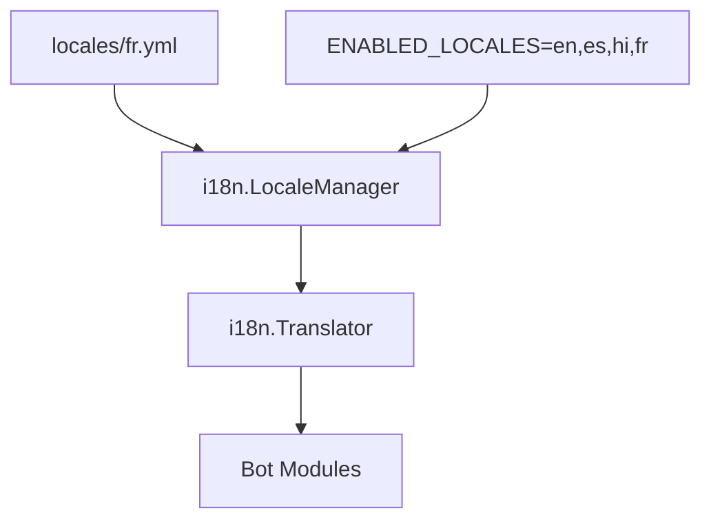

# Design: french-translation

## Overview

Add French locale by creating `locales/fr.yml` with complete translations. No code changes required - the i18n system dynamically loads all YAML files from the locales directory.

## Architecture



## Components

### Component: fr.yml Locale File

**Purpose**: Provide French translations for all bot strings

**Structure**:
```yaml
# Metadata (required)
lang_sample: Français standard
language_flag: "🇫🇷"
language_name: Français

# Module strings (alphabetically organized)
admin_adminlist: "Admins dans <b>%s</b> :"
admin_anon_admin_already_disabled: "Le mode AnonAdmin est déjà <b>désactivé</b> pour %s"
# ... all other keys
```

**Responsibilities**:
- Provide translations for all keys from en.yml
- Maintain key naming consistency with en.yml
- Use proper YAML formatting with double quotes for escape sequences

## Data Flow

1. Bot startup loads all `locales/*.yml` files via LocaleManager
2. User changes language via `/lang` command
3. Language code stored in DB (users or chats table)
4. Module code calls `i18n.MustNewTranslator(langCode)`
5. Translator returns French string for requested key

## Technical Decisions

| Decision | Options | Choice | Rationale |
|----------|---------|--------|-----------|
| File location | locales/fr.yml | locales/fr.yml | Matches existing pattern |
| Key naming | Match en.yml exactly | Match en.yml | Required for i18n lookup |
| Quoting style | Single/Double | Double for \n | YAML spec requires double for escapes |
| Formality | Tu/Vous | Vous | Professional tone for group management |

## File Structure

| File | Action | Purpose |
|------|--------|---------|
| locales/fr.yml | Create | French translations |
| sample.env | Update (optional) | Document fr in ENABLED_LOCALES |

## Translation Format Patterns

### Simple Strings
```yaml
admin_demote_is_bot_itself: "Je ne vais pas me rétrograder moi-même."
```

### Strings with Parameters
```yaml
# %s = username
admin_demote_success_demote: "%s a été rétrogradé avec succès !"
```

### Strings with HTML
```yaml
admin_adminlist: "Admins dans <b>%s</b> :"
```

### Multi-line with Newlines
```yaml
# Use double quotes for \n
admin_anon_admin_disabled: "Le mode AnonAdmin est actuellement <b>désactivé</b> pour %s.\n\nLes admins anonymes doivent confirmer leurs permissions."
```

### Block Scalars for Help Messages
```yaml
admin_help_msg: |
  Gérez facilement les promotions et rétrogradations !

  *Commandes utilisateur :*

  × /adminlist : Liste des admins du groupe.

  *Commandes admin :*

  × /promote `<reply/username/mention/userid>` : Promouvoir un utilisateur.
  × /demote `<reply/username/mention/userid>` : Rétrograder un utilisateur.
```

## Error Handling

| Error | Handling | User Impact |
|-------|----------|-------------|
| Missing key in fr.yml | Falls back to en.yml | User sees English for that string |
| Invalid YAML syntax | Bot fails to start | Critical - must validate YAML |
| Wrong printf formatter | Runtime format error | Garbled message output |

## Existing Patterns to Follow

### From hi.yml (Hindi locale)
```yaml
# Proper double quotes for escape sequences
admin_anon_admin_disabled: "AnonAdmin मोड वर्तमान में %s के लिए <b>अक्षम</b> है।\n\n  इसके लिए..."
```

### From es.yml (Spanish locale)
```yaml
# Consistent key naming
admin_adminlist: "Administradores en <b>%s</b>:"
```

## Quality Checklist

Before completion:
- [ ] All keys from en.yml present in fr.yml
- [ ] YAML syntax valid (test with `yq` or similar)
- [ ] Printf formatters match en.yml (%s, %d order)
- [ ] HTML tags preserved exactly
- [ ] Escape sequences use double quotes
- [ ] Language metadata keys set correctly
- [ ] Bot loads without errors
